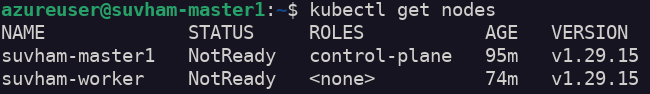
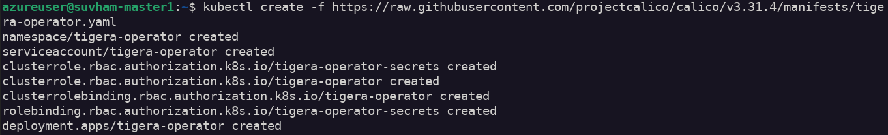
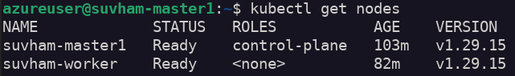

# Assignment 2

## Deploy Kubernetes using kubeadm

### Install containerd

We need to install containerd on both master node and worker node.

Firstly we need to update our packages. `-y` is used for automatically confirm upgrading packages (dont provide user prompt).

```bash
$ sudo apt update
$ sudo apt upgrade -y
```

Install containerd

```bash
$ sudo apt install containerd -y
```

Create the `containerd` directory under `/etc`. `-p` flag is used to not throw errors if directory exists.

```bash
$ sudo mkdir -p /etc/containerd 
```

Output the default configuration of containerd and save it to `/etc/containerd/config.toml`.
`tee` command reads from standard input and outputs to standard output and to a file (if provided).

```bash
$ containerd config default | sudo tee /etc/containerd/config.toml
```

We now need to update the `SystemdCgroups = false` to `SystemdCgroup = true`. By doing this containerd will use systemd as cgroups driver.

We will use `sed` (stream editor) for this. `-i` flag denotes to edit the file in place.

```bash
$ sudo sed -i 's/SystemdCgroup = false/SystemdCgroup = true/' /etc/containerd/config.toml
```

We now need to restart the containerd service to use the updated config file.
We also need to enable the containerd service to start on system startup.

```bash
$ sudo systemctl restart containerd
$ sudo systemctl enable containerd
```
### Preinstall node configurations

Before running installation commands we need to disable `swap` on all nodes.

If we run out of ram space, the os moves out unused pages from the ram to a swap space, to make more room for ram.This swap space is created on the disk as a parition or a file.

Thats why `swap` partition/file can affect the performance of pods running on the node, because `swap` is created on the disk which is much slower than using ram.

```bash
$ sudo swapoff -a
```

Edit the `/etc/fstab` file to permanently disable swap even after boot.

```bash
$ sudo sed -i '/ swap / s/^/#/' /etc/fstab
```

Load kernel modules: overlay, br_netfilter

We need to enable ip-forwarding.
By default linux rejects all packets that arent meant for itself. Ip forwarding allows routing of packets to other destinations (eg Pods/Containers).This enables pods/containers to communicate with the outside world.

We also need to enable the traffic that goes throught the virtual bridge, that helps pods to communicate with each other, to also pass through iptables.

`sysctl` configure kernel parameters at runtime

We need to load kernel modules.

```bash
$ sudo modprobe overlay
$ sudo modprobe br_netfilter
```

We need to add these configurations to `/etc/modules-load.d/k8s.conf`

```
overlay
br_netfilter
```

We need to add these configurations to `/etc/sysctl.d/k8s.conf`

```
net.bridge.bridge-nf-call-iptables  = 1
net.bridge.bridge-nf-call-ip6tables = 1
net.ipv4.ip_forward                 = 1
```

### Install kubelet, kubeadm, kubectl 

We need to install `kubeadm` and `kubelet` on all the nodes including master and workers.

kubelet is a systemd service that needs to run on all the nodes.It helps in creation of pods on the nodes, it reports pod health and node health back to api server.It tries to match the desired state defined in `etcd` database with the real state of the node on which the kubelet is running, it the node is assigned more pods, then kubelet will get the pod specs and use containerd to run the pods.

First we need to add kubernetes repository to get the packages.

```bash
$ sudo apt update
$ sudo apt install curl gpg
$ curl -fsSL https://pkgs.k8s.io/core:/stable:/v1.29/deb/Release.key | sudo gpg --dearmor -o /etc/apt/keyrings/kubernetes-apt-keyring.gpg
$ echo "deb [signed-by=/etc/apt/keyrings/kubernetes-apt-keyring.gpg] https://pkgs.k8s.io/core:/stable:/v1.29/deb/ /" | sudo tee /etc/apt/sources.list.d/kubernetes.list 
```

Now we can install `kubeadm`, `kubelet` and `kubectl` packages.

```bash
$ sudo apt update
$ sudo apt install kubelet
```

kubeadm is used to initialise a kubernetes cluster. It helps in initialising the control plane(master nodes) with necessary components such as `kube-apiserver`, `etcd`, `kube-scheduler`, `kube-controller-manager` etc.

It also helps in adding new worker nodes or master nodes to an existing cluster.

```bash
$ sudo apt install kubeadm
```

We should prevent our installed packages from upgrading to a new version as it may introduce breaking changes.

```bash
$ sudo apt-mark hold kubeadm kubelet kubectl
```
We should now initiate our control plane node using `kubeadm init`.
`10.0.0.7` is the master node ip.
`--pod-network-cidr` is used to specify the ip address range of the pods and nodes.

```bash
$ sudo kubeadm init --pod-network-cidr=192.168.0.0/16 --apiserver-advertise-address=10.0.0.7
```

We can copy the kubeconfig to `$HOME/.kube/` directory so that we can interact with the cluster using kubectl.

```bash
$ mkdir $HOME/.kube/
$ sudo cp /etc/kubernetes/admin.conf $HOME/.kube/config
$ sudo chown $(id -u):$(id -g) $HOME/.kube/config
```

Using `kubectl get nodes` gives us this output



The nodes are in `NotReady` state because it requires another component, a network plugin.
For that we are going to use `Calico`, which we will configure in the next steps.

`kubeadm init` outputs the command to join worker nodes to the cluster.
We can use that command for our worker node.

In the worker node terminal we can use this command.

```bash
$ kubeadm join 10.0.0.7:6443 --token <token> --discovery-token-ca-cert <token> 
```

## Configure pod networking

Here we are going to use Calico for our CNI plugin.
Calico enables networking for the pods.It gives ip addresses to all the pods and nodes with a ip range.It also enables cross node networking. 

In the master node we can install the Tigera Operator and CRDs.

```bash
$ kubectl create -f https://raw.githubusercontent.com/projectcalico/calico/v3.31.4/manifests/tigera-operator.yaml
```


Create custom Calico resources.

```bash
$ kubectl create -f https://raw.githubusercontent.com/projectcalico/calico/v3.31.4/manifests/custom-resources.yaml
```


Now if we run `kubectl get nodes` from our master nodee, we will get that all our nodes are in `ReadyState`.

