# Assignment 2

## Deploy Kubernetes using kubeadm

### Install containerd

We need to install containerd on both master node and worker node.

Firstly we need to update our packages. `-y` is used for automatically confirm upgrading packages (dont provide user prompt).

```bash
$ sudo apt update
$ sudo apt upgrade -y
```

Install containerd

```bash
$ sudo apt install containerd -y
```

Create the `containerd` directory under `/etc`. `-p` flag is used to not throw errors if directory exists.

```bash
$ sudo mkdir -p /etc/containerd 
```

Output the default configuration of containerd and save it to `/etc/containerd/config.toml`.
`tee` command reads from standard input and outputs to standard output and to a file (if provided).

```bash
$ containerd config default | sudo tee /etc/containerd/config.toml
```

We now need to update the `SystemdCgroups = false` to `SystemdCgroup = true`. By doing this containerd will use systemd as cgroups driver.

We will use `sed` (stream editor) for this. `-i` flag denotes to edit the file in place.

```bash
$ sudo sed -i 's/SystemdCgroup = false/SystemdCgroup = true/' /etc/containerd/config.toml
```

We now need to restart the containerd service to use the updated config file.
We also need to enable the containerd service to start on system startup.

```bash
$ sudo systemctl restart containerd
$ sudo systemctl enable containerd
```
### Preinstall node configurations

Before running installation commands we need to disable `swap` on all nodes.

If we run out of ram space, the os moves out unused pages from the ram to a swap space, to make more room for ram.This swap space is created on the disk as a parition or a file.

Thats why `swap` partition/file can affect the performance of pods running on the node, because `swap` is created on the disk which is much slower than using ram.

```bash
$ sudo swapoff -a
```

Edit the `/etc/fstab` file to permanently disable swap even after boot.

```bash
$ sudo sed -i '/ swap / s/^/#/' /etc/fstab
```

Load kernel modules: overlay, br_netfilter

We need to enable ip-forwarding.
By default linux rejects all packets that arent meant for itself. Ip forwarding allows routing of packets to other destinations (eg Pods/Containers).This enables pods/containers to communicate with the outside world.

We also need to enable the traffic that goes throught the virtual bridge, that helps pods to communicate with each other, to also pass through iptables.

`sysctl` configure kernel parameters at runtime

We need to load kernel modules.

```bash
$ sudo modprobe overlay
$ sudo modprobe br_netfilter
```

We need to add these configurations to `/etc/modules-load.d/k8s.conf`

```
overlay
br_netfilter
```

We need to add these configurations to `/etc/sysctl.d/k8s.conf`

```
net.bridge.bridge-nf-call-iptables  = 1
net.bridge.bridge-nf-call-ip6tables = 1
net.ipv4.ip_forward                 = 1
```

### Install kubelet, kubeadm, kubectl 

We need to install `kubeadm` and `kubelet` on all the nodes including master and workers.

kubelet is a systemd service that needs to run on all the nodes.It helps in creation of pods on the nodes, it reports pod health and node health back to api server.It tries to match the desired state defined in `etcd` database with the real state of the node on which the kubelet is running, it the node is assigned more pods, then kubelet will get the pod specs and use containerd to run the pods.

First we need to add kubernetes repository to get the packages.

```bash
$ sudo apt update
$ sudo apt install curl gpg
$ curl -fsSL https://pkgs.k8s.io/core:/stable:/v1.29/deb/Release.key | sudo gpg --dearmor -o /etc/apt/keyrings/kubernetes-apt-keyring.gpg
$ echo "deb [signed-by=/etc/apt/keyrings/kubernetes-apt-keyring.gpg] https://pkgs.k8s.io/core:/stable:/v1.29/deb/ /" | sudo tee /etc/apt/sources.list.d/kubernetes.list 
```

Now we can install `kubeadm`, `kubelet` and `kubectl` packages.

```bash
$ sudo apt update
$ sudo apt install kubelet
```

kubeadm is used to initialise a kubernetes cluster. It helps in initialising the control plane(master nodes) with necessary components such as `kube-apiserver`, `etcd`, `kube-scheduler`, `kube-controller-manager` etc.

It also helps in adding new worker nodes or master nodes to an existing cluster.

```bash
$ sudo apt install kubeadm
```

We should prevent our installed packages from upgrading to a new version as it may introduce breaking changes.

```bash
$ sudo apt-mark hold kubeadm kubelet kubectl
```
We should now initiate our control plane node using `kubeadm init`.
`10.0.0.7` is the master node ip.
`--pod-network-cidr` is used to specify the ip address range of the pods and nodes.

```bash
$ sudo kubeadm init --pod-network-cidr=192.168.0.0/16 --apiserver-advertise-address=10.0.0.7
```

We can copy the kubeconfig to `$HOME/.kube/` directory so that we can interact with the cluster using kubectl.

```bash
$ mkdir $HOME/.kube/
$ sudo cp /etc/kubernetes/admin.conf $HOME/.kube/config
$ sudo chown $(id -u):$(id -g) $HOME/.kube/config
```

Using `kubectl get nodes` gives us this output


The nodes are in `NotReady` state because it requires another component, a network plugin.
For that we are going to use `Calico`, which we will configure in the next steps.

`kubeadm init` outputs the command to join worker nodes to the cluster.
We can use that command for our worker node.

In the worker node terminal we can use this command.

```bash
$ kubeadm join 10.0.0.7:6443 --token <token> --discovery-token-ca-cert <token> 
```

## Configure pod networking

Here we are going to use Calico for our CNI plugin.
Calico enables networking for the pods.It gives ip addresses to all the pods and nodes with a ip range for the pods.It also enables cross node networking. 

In the master node we can install the Tigera Operator and CRDs.

```bash
$ kubectl create -f https://raw.githubusercontent.com/projectcalico/calico/v3.31.4/manifests/tigera-operator.yaml
```


Create custom Calico resources.

```bash
$ kubectl create -f https://raw.githubusercontent.com/projectcalico/calico/v3.31.4/manifests/custom-resources.yaml
```


Now if we run `kubectl get nodes` from our master nodee, we will get that all our nodes are in `ReadyState`.


## Configure jump server access

### Enable ssh access

We can easily ssh into our cluster nodes using password based authentication, by using the jump server as a proxy server for our connection.

Create config file in `~/.ssh` directory, with the following contents.

```bash
Host jump-server
	Hostname 4.240.92.148
	User azureuser

Host master-node
	Hostname 10.0.0.7
	User azureuser
	ProxyJump jump-server

Host worker-node
	Hostname 10.0.0.8
	User azureuser
	ProxyJump jump-server
```

This will help to easily login to our vms.

```bash
$ ssh jump-server # key pair authentication
$ ssh master-node # password based authentication
$ ssh worker-node # password based authentication
```

### Copy kubeconfig from control plane to jump server

We can use `scp` command to copy files from one host to another securely.

From the jump server enter these commands.

Make `.kube` directory in the home directory.

```bash
$ mkdir ~/.kube
```

Copy kubeconfig from master-node to jump-server.

```bash
$ scp azureuser@10.0.0.7:/home/azureuser/.kube/config /home/azureuser/.kube/config
```
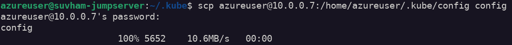

Ensure that `cluster.server` ip address in the kubeconfig points to the master node `https://10.0.0.7:6443` address.The api-server listens on port `6443`.

### Install kubectl on jump server


We need to add kubernetes repository to get packages.

```bash
$ sudo apt update
$ sudo apt install curl gpg
$ curl -fsSL https://pkgs.k8s.io/core:/stable:/v1.29/deb/Release.key | sudo gpg --dearmor -o /etc/apt/keyrings/kubernetes-apt-keyring.gpg
$ echo "deb [signed-by=/etc/apt/keyrings/kubernetes-apt-keyring.gpg] https://pkgs.k8s.io/core:/stable:/v1.29/deb/ /" | sudo tee /etc/apt/sources.list.d/kubernetes.list 
```

Then install `kubectl`.

```bash
$ sudo apt update
$ sudo apt install kubectl
```

Run `kubectl version` to ensure you can interact with the cluster from the jump server.

```bash
$ kubectl version
$ kubectl get nodes
```

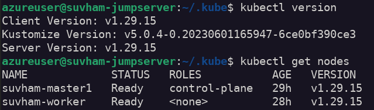

## Install MetalLB

If we want to loadbalance the traffic to our backend pods, we need a loadbalancer.If we create a service of type `Loadbalancer` K8s doesnt have a load balancer implementation of its own. It will try to call the cloud provider api for a loadbalancer creation.
Since we are running our cluster on bare metal servers, the loadbalancer service will not be assigned to a loadbalancer.Therefore the external ip remains in pending state.

MetalLB in Layer 2 mode helps in loadbalancing traffic, by selecting a leader node from the cluster of nodes and assigning a ip address from the ip pool, that we have provided to MetalLB.All the traffic for that service goes through the leader node and to all the other nodes.

We will install `helm` on our jump server to install MetalLB on our cluster.

```bash
curl -fsSL https://packages.buildkite.com/helm-linux/helm-debian/gpgkey | gpg --dearmor | sudo tee /usr/share/keyrings/helm.gpg > /dev/null
echo "deb [signed-by=/usr/share/keyrings/helm.gpg] https://packages.buildkite.com/helm-linux/helm-debian/any/ any main" | sudo tee /etc/apt/sources.list.d/helm-stable-debian.list
sudo apt-get update
sudo apt-get install helm
sudo apt-mark hold helm
```

We will then install MetalLB using Helm.

```bash
$ helm repo add metallb https://metallb.github.io/metallb
$ helm repo update
$ helm install metallb metallb/metallb --namespace metallb-system --create-namespace 
```

Verify our metallb release.
We have 2 speaker pods, each running on each node.

```bash
$ kubectl get all -n metallb-system
```

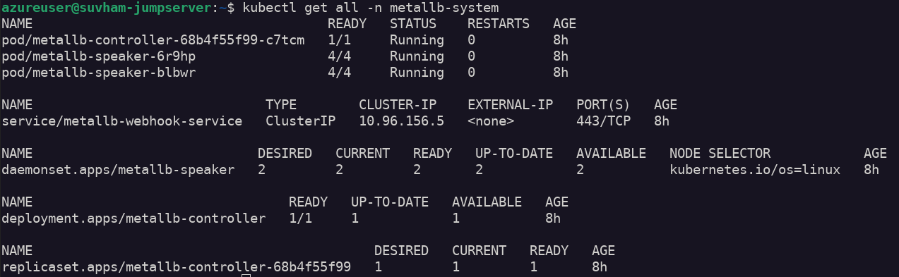

Create custom resources.

`IPAddressPool` is a range of ips that we provide to metallb to give to different loadbalancer services.

```yaml
apiVersion: metallb.io/v1beta1
kind: IPAddressPool
metadata:
  name: ipaddress-pool
  namespace: metallb-system

spec:
  addresses:
  - 10.0.0.7-10.0.0.8

  autoAssign: true

---

apiVersion: metallb.io/v1beta1
kind: L2Advertisement
metadata:
  name: l2-advertisement
  namespace: metallb-system

spec:
  ipAddressPools:
  - ipaddress-pool
```

Now we can verify if our loadbalancer services are working.

We can deploy our application using helm

Create a tar file of our local chart and send it to the jump server using `scp` command.

```bash
$ tar zcf app_chart.tar.gz app_chart
$ scp app_chart.tar.gz azureuser@jump-server:/home/azureuser/app_chart.tar.gz
```

Create a `dev` namespace if it doesnt exists already.
Then we can install our application.

```bash
$ kubectl create ns dev
$ helm install app app_chart --namespace dev
```

List the helm releases.

```bash
$ helm list -A
```

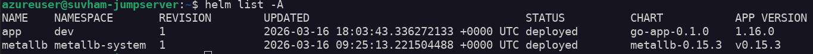

Check if loadbalancer service is reachable 


Verify our application deployment.

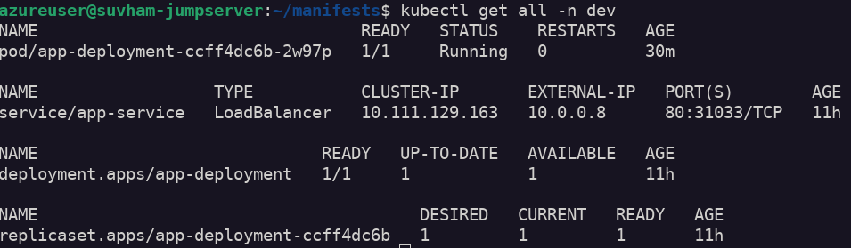

## Configure SSL with cert-manager

### Install cert-manager using helm

We can install cert-manager in our cluster using helm.

Firstly we need to add the repository.

```sh
$ helm repo add jetstack https://charts.jetstack.io
$ helm repo update
```

We can now install cert-manager in cert-manager namespace.

```sh
$ helm install cert-manager jetstack/cert-manager \
  --namespace cert-manager --create-namespace \
  --version v1.20.0 \
  --set crds.enabled=true
``` 

Verify the installation

```sh
$ kubectl get all -n cert-manager
```

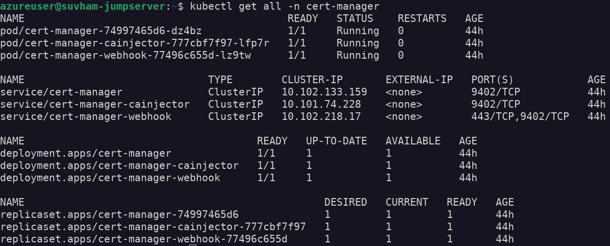


### Configure Issuer

An Issuer tells cert-manager on how to request TLS certificates.Issuers are specific to a namespace, while ClusterIssuers are cluster-wide version.ClusterIssuer resource apply across all ingress resources in the cluster.

Here we will create `ClusterIssuer`.

We will create two Issuers for Lets Encrypt.
- staging
- production
This is because production issuer has strict rate limits, thats why we can use staging to ensure everything is working as expected then we can switch to production.

Using staging issuer will cause warnings about `untrusted certificates`.That is normal.

`http01` challenge is to test existence of the server.
The cert-manager will create a ingress resource to validate the domain.

Here we will create the staging ClusterIssuer resource.

```yaml
apiVersion: cert-manager.io/v1
kind: ClusterIssuer
metadata:
  name: letsencrypt-staging

spec:
  acme:
    server: https://acme-staging-v02.api.letsencrypt.org/directory

    email: <your-email-id>

    profile: tlsserver

    privateKeySecretRef:
      name: letsencrypt-staging-acme-account

    solvers:
    - http01:
        ingress:
          ingressClassName: nginx
```

We will also create the production ClusterIssuer resource.

```yaml
apiVersion: cert-manager.io/v1
kind: ClusterIssuer
metadata:
  name: letsencrypt-prod

spec:
  acme:
    server: https://acme-v02.api.letsencrypt.org/directory

    email: <your-email-id>

    profile: tlsserver

    privateKeySecretRef:
      name: letsencrypt-prod

    solvers:
    - http01:
        ingress:
          ingressClassName: nginx
```

### Update ingress

We will now edit our ingress resource in our `dev` namespace.

We will add the following to our ingress:

Add the annotation under the metadata:

```yaml
annotations:
  cert-manager.io/issuer: "letsencrypt-staging"
```

Under `spec` add the following:

```yaml
tls:
  - hosts:
    - virtual-swan.webhop.me
    secretName: tls-secret
```
Cert-manager will see these annotations on the ingress resource and use it to request a certificate.

After validation the certificate will be issued, which we can see.

```sh
$ kubectl get certificate tls-secret -n dev
```

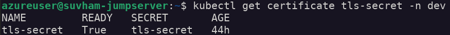

Since everything is working as expected, we can now use the production issuer.

We now need to update the annotation in our ingress resource.

```yaml
annotations:
  cert-manager.io/issuer: "letsencrypt-prod"
```
We need to delete the secret that cert-manager is watching to reprocess the certificate creation, using the updated ingress resource.

```sh
$ kubectl delete secret tls-secret -n dev 
```

This will start the process of getting a new certificate.
After certificate is issued we can view the certificate.

```sh
$ kubectl describe secret tls-secret -n dev
```

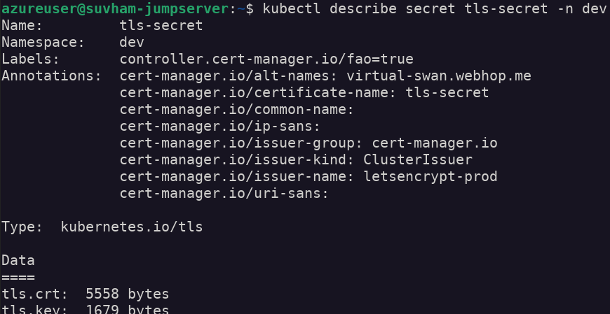

### Test HTTPS access

We can now access our application using HTTPS.

Before that we need to port-forward to our ingress on local port 443(https) and ingress service port 443(https)

```sh
$ kubectl port-forward svc/ingress-nginx-controller -n ingress-nginx 443:443 --address 10.0.0.5
```

Now we can view our application in browser or terminal.


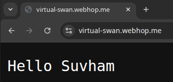

### Configure auto renewal

The auto renewal of certificates is configured by default with an duration of 90 days and renewal starts 30 days before expiry.

```sh
$ kubectl describe certificate tls-secret -n dev -o yaml
```

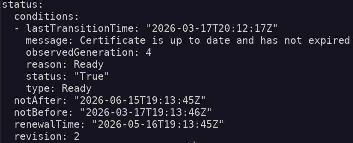

## Create CICD Pipeline

We are going to create a CICD pipeline for our application using Github Actions.

### Create a application repository

We need to create an application repository with our application code and helm chart in it.

[repository link](https://github.com/suvham-ini8labs/go-app)

### Create a workflow file

Under `.github/workflows/` we will create a file name `pipeline.yaml` and use the following code.

```yaml
name: cicd

on:
  push:
    branches: [ "main" ]

jobs:
  build:
    runs-on: ubuntu-latest
    outputs:
      image-tag: ${{ steps.tag.outputs.tag }}

    steps:
    - name: checkout code
      uses: actions/checkout@v6.0.2

    - name: docker login
      uses: docker/login-action@v4.0.0
      with:
        username: ${{ secrets.DOCKER_USERNAME }}
        password: ${{ secrets.DOCKER_PASSWORD }}

    - name: generate image tag
      id: tag
      run: echo "tag=${{ github.sha }}" >> $GITHUB_OUTPUT
      
    - name: build and push
      uses: docker/build-push-action@v7.0.0
      with:
        push: true
        context: ./app/
        tags: spaul76/simple-app:${{ steps.tag.outputs.tag }}
       
  deploy:
    runs-on: self-hosted
    name: deploy
    needs: build 

    steps:
    - name: checkout code
      uses: actions/checkout@v6.0.2

    - name: save kubeconfig
      run: |
        mkdir .kube
        touch .kube/config
        echo "${{ secrets.KUBECONFIG }}" > .kube/config

    - name: deploy with helm
      env: 
        KUBECONFIG: .kube/config
      run: helm upgrade app app_chart --namespace dev --set deployment.pod.container.tag=${{ needs.build.outputs.image-tag }}
```

Here we are using our jump server as self hosted github runner.

### Add Github Secrets

Under `Repository > Settings > Secrets and Variables > Actions` we will add the following as our repository secrets.
- docker username
- docker password
- kubeconfig file contents

We are using these secrets in our pipeline.

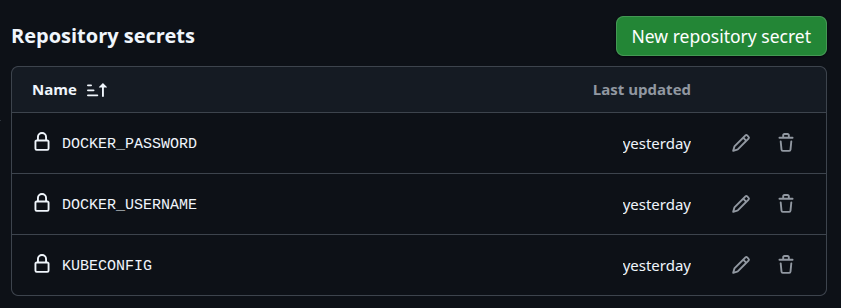

### Automated build and deploy

On new commits on main branch the pipeline will trigger.

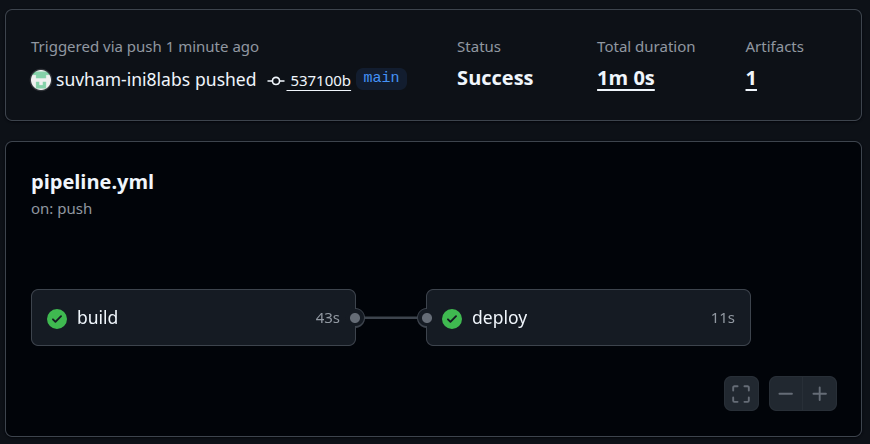